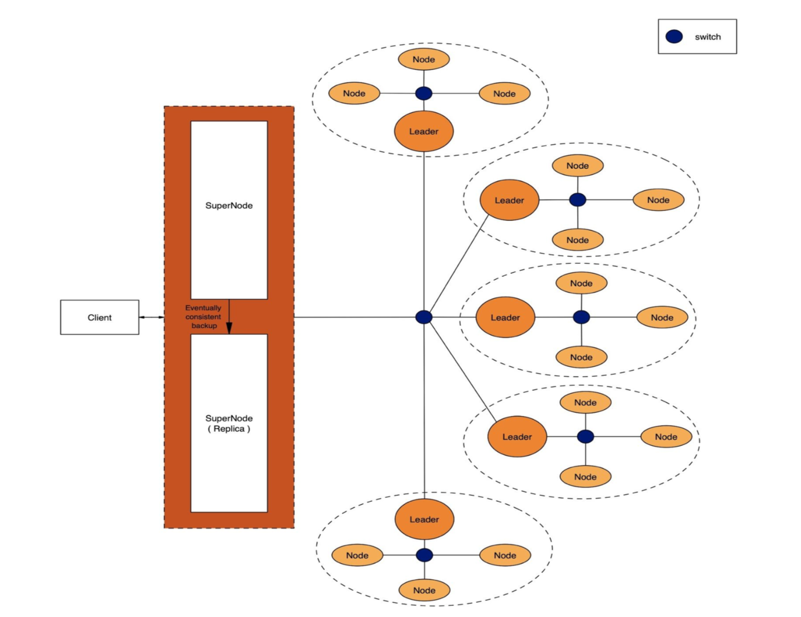

# Distributed File Storage

Project Fluffy is an open-source, scalable, decentralized, robust, heterogeneous file storage solution which ensures that multiple servers can inter-operate to form a dynamic ‘overlay’ fabric.
The system supports some important design aspects such as -
- Language Agnostic
- System failure & recovery
- Work-stealing algorithms
- Scalability
- Robustness
- Queues to serve multiple requests simultaneously
- Cluster Consensus (RAFT)
- Data Replication
- Caching Optimization
- Efficient Searching
##### The following user services are currently supported (with an option to modularly add new services at any time) - 

    1. File Upload (supports any file type - pdf, img, avi, txt, mp4, xml, json, m4v, etc.)
    2. File Download
    3. File Search
    4. File List (Lists all files on the system that belong to a specific user)
    5. File Delete
    6. File Update

This system allows many clients to have access to data and supports operations (create, delete, modify, read, write) on that data. Each data file is partitioned into several parts called chunks. Each chunk is stored on different remote machines, facilitating the parallel execution of applications.

****************************************************************************************************************


### Architecture Diagram



****************************************************************************************************************

### Technology Stack


****************************************************************************************************************

### Usage
- install all depenedencies as mentioned in requirements.txt
- Check config.yaml to configure the server IPs and other parameters. 
- Update iptable.txt to incude all the IPs in your cluster (for each individual cluster)


## changes needed
- install redis & `redis-server`
- updated requirements.txt (2 files)
- Delete _pb2.py & _pb2_grpc.py files in proto/ as well as SuperNode/proto/
- Delete generated/ dir
- updated build_pb.sh & SuperNode/build.sh
- updated config.yaml

### Basic setup
```bash

# Start mongodb server

# Start redis-server
redis-server

# (For macos => python3-intel64 -m venv venv)
python -m venv venv

source venv/bin/activate
pip install -r requirements.txt
```

#### Starting supernode
```
# Imp to go into supernode dir
cd SuperNode/
./build_pb.sh
python3 superNode.py
```

#### Strating cluster nodes
```
./build_pb.sh
python3 server.py one
```
```
python3 server.py two
```
```
python3 server.py three
```

#### Starting client
```
python3 client.py
```
